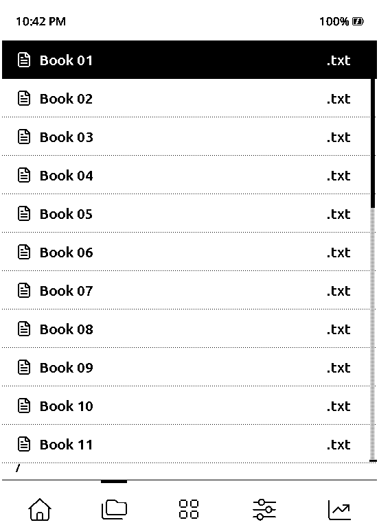
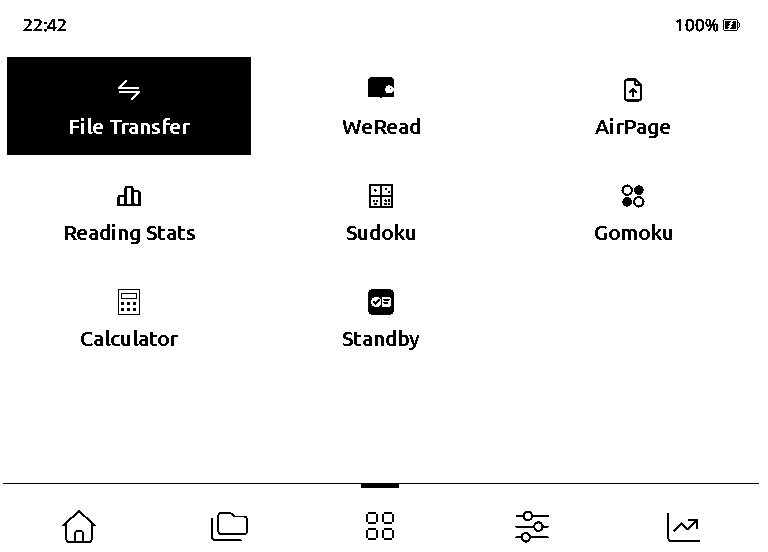
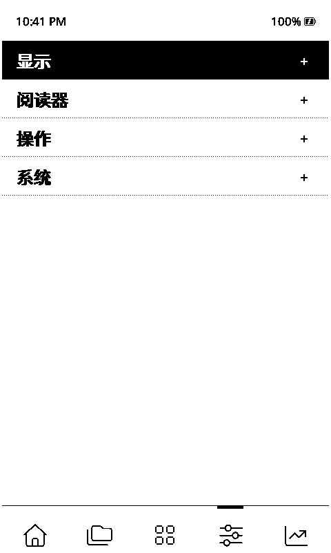
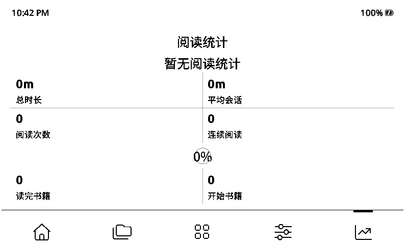

# Inx tab layout validation

Validated against main `03a9c7ce4daa28fbac81c62b4d9b82d5a792b60e`, with its pinned
FreeInk SDK `34d36ecc37b192f0082cb889a8bb53c887b8d096` and simulator
`dacbbbcdc133a052f9122347429fdcb8cddf80af`.

The touch-only bottom-tab layout reserves a 44 px status bar inside the board's
viewable margins, then a 6 px gap, content, another 6 px gap, and navigation.
All five tabs share this geometry. The clock follows the configured format and
time zone; invalid time displays `--:--`. It updates on page renders, without
adding periodic display refreshes. Battery percentage follows its existing setting.

Bottom navigation keeps its 66 px height: the 1 px separator sits on its top
edge, with the centered 38 × 5 px selected marker covering that segment.
The 38 px icons sit 4 px above the navigation area's bottom edge, 10 px lower
than the previous centered layout. Board safe margins, physical-button hints,
tab hit regions and their 6 px gaps are unchanged. Top-tab rendering, content
and the time/battery status bar are unchanged.

## Automated checks

```sh
cmake -S test -B build/test
cmake --build build/test --target InxNavigationTest TimeUtilsTest -j 4
ctest --test-dir build/test -R 'InxNavigation|TimeUtils' --output-on-failure
./bin/clang-format-fix --check
pio run -e simulator -e simulator_eego_a4 -e simulator_murphy_m4
```

The 27 host tests cover tab order, drawing/hit bounds and gaps, status-bar
eligibility, content reservations, app-grid hit bounds, and valid/invalid
12/24-hour time formatting.

## Native simulator checks

Twelve runs produced 63 screenshots using isolated simulated SD cards:

| Device | Scenarios |
| --- | --- |
| A4 | English empty state, Chinese 25-book list, English landscape, top tabs, hidden battery percentage |
| Murphy M4 | Chinese empty state, English 25-book list, Chinese landscape, top tabs, Classic theme |
| X4 (no touch) | Default top tabs and explicitly selected bottom tabs, with button navigation |

Each Inx run visits Recent, Library, Apps, Settings and Statistics. Additional
touch checks open and dismiss the control center from every bottom-tab page,
tap the status/content gap and a tab gap without activation, and open Book 01
and Book 22 (the last fully visible item after scrolling) from the library.
Selecting Top in Settings persists across a process restart.

After the bottom-alignment change, all twelve scenarios were rerun. Pixel
comparisons of the 56 main-page screenshots against the previous build verified
the top-edge separator and 38 × 5 px selected segment, the unchanged icon strip
shifted down exactly 10 px, and the 4 px clear bottom inset. The same comparisons
confirmed unchanged top-tab strips, safe margins and X4 physical-button hints.

Use `CROSSPOINT_SIM_SD` to select an isolated SD directory. Its
`.crosspoint/settings.json` can start with
`{"uiTheme":5,"language":"EN","onboardingVersion":1,"clockUtcOffsetQ":80}`.
Omitting `inxTabPosition` tests the board default; `0` selects top, `1` bottom.
Use `language: "ZH_CN"` and `clockFormat: 1` for Chinese and a 12-hour clock.

Example A4 bottom-tab navigation, after creating `/tmp/inx-shots`:

```sh
CROSSPOINT_SIM_SD=/tmp/inx-sd \
CROSSPOINT_SIM_INPUT_SCRIPT='2100:TAP:0.3,0.93;3200:TAP:0.5,0.93;4300:TAP:0.7,0.93;5400:TAP:0.9,0.93;6500:TAP:0.3,0.04;7800:QUIT' \
CROSSPOINT_SIM_SCREENSHOTS='1600:/tmp/inx-shots/recent.bmp;2700:/tmp/inx-shots/library.bmp;3800:/tmp/inx-shots/apps.bmp;4900:/tmp/inx-shots/settings.bmp;6000:/tmp/inx-shots/stats.bmp;7100:/tmp/inx-shots/control.bmp' \
xvfb-run -a .pio/build/simulator_eego_a4/program
```

Main menus currently run in portrait. The landscape stress checks temporarily
set the live renderer orientation using GDB at `InxRecentActivity::onEnter()`;
they do not add a menu-rotation setting. Use normalized scripted coordinates
because the simulator parses its input schedule before this breakpoint.

```gdb
break InxRecentActivity::onEnter()
commands
silent
call (void) 'GfxRenderer::setOrientation(GfxRenderer::Orientation)'(&renderer, 1)
disable 1
continue
end
run
```

## Captured screens

These are losslessly converted native simulator screenshots. The simulator
retains selection highlighting; hardware touch-focus policy is unchanged.

| Recent (A4) | Library (A4, Chinese) |
| --- | --- |
|  |  |







[X4 bottom tabs with physical-button hints](images/inx-tabs/x4-bottom.png)

Physical touch-controller behavior, EPD ghosting, refresh timing, and power
consumption still require device validation; the simulator does not model them.

## Hardware build results

PaperMono builds successfully with a fresh isolated PlatformIO core/package
directory: 116,076 bytes static RAM and 5,957,294 bytes Flash reported by
PlatformIO. These are complete-image sizes, not incremental costs of this change.

The default C3 build compiles but fails to link with missing
`ble_base_funcs_reset`, `ble_42_adv_funcs_reset` and related BLE controller symbols
referenced by ESP-IDF's `bt.c`. The same failure occurs in the existing package
cache, a freshly provisioned isolated core, and an unmodified checkout of main
`03a9c7ce`. Therefore the C3 build is **not passing in this environment**; the
baseline comparison establishes that this failure also occurs without the Inx
changes. No BLE/toolchain workaround is included in this UI change.
